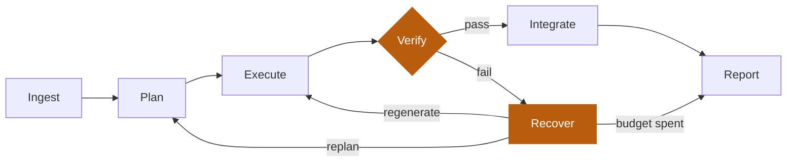

<a href="https://sohailgidwani.app">
  <picture>
    <source media="(prefers-color-scheme: dark)" srcset="https://raw.githubusercontent.com/SohailGidwani/SohailGidwani/main/dark_mode.svg">
    
  </picture>
</a>

<p align="center">
  <a href="https://sohailgidwani.app/"></a>
  <a href="mailto:sohailgidwani15@gmail.com"></a>
  <a href="https://www.linkedin.com/in/sohail-gidwani/"></a>
  <a href="https://sohailgidwani.app/api/mcp"></a>
</p>

## Selected work

| | What it is | Result |
|---|---|---|
| **[MEMOIR&#8209;VLM](https://sohailgidwani.app/research/memoir-vlm-alzheimers-vqa)** | Multimodal vision-language model for Alzheimer's classification and VQA | `0.933` bal. acc. CN vs Dementia · `0.981` AUC · ~70M params · 2,363 subjects |
| **[Portage](https://sohailgidwani.app/projects/portage)** | Autonomous agent that migrates Flask to FastAPI and proves it with the repo's own tests | `61.9%` strict green · 21 autonomous runs · 7 pinned repos at K=3 |
| **[Knowledge&nbsp;Hub](https://sohailgidwani.app/projects/knowledge-hub)** | Local-first document system: OCR, hybrid retrieval, cited RAG answers | One Postgres + pgvector store, no separate vector DB |
| **[CoT&nbsp;Faithfulness](https://sohailgidwani.app/projects/cot-faithfulness)** | Does chain-of-thought drive the answer, or rationalise it after the fact? | `~15,000` deterministic queries · 4 controlled experiments |

<p align="right"><a href="https://sohailgidwani.app/projects"><b>All projects →</b></a></p>

## How Portage thinks

A migration only counts if the repo's own tests still pass. The agent plans, rewrites, verifies in a
network-off sandbox, and recovers under bounded budgets. It reports red when it fails.



<details>
<summary><b>Experience</b></summary>

<br />

| | | |
|---|---|---|
| `OCT 2025 - NOW` | **Research Assistant** | Keck School of Medicine of USC |
| `MAY 2025 - JUL 2025` | **Senior Software Engineer - I** | Insaito, Inc. |
| `JUN 2023 - MAY 2025` | **Full Stack - Software Developer** | IIFL Finance Ltd |

</details>

<details>
<summary><b>Stack</b></summary>

<br />

**ML / AI** &nbsp;·&nbsp; PyTorch · TensorFlow · scikit-learn · OpenCV · HuggingFace · LangGraph · Ollama · MCP

**Languages** &nbsp;·&nbsp; Python · TypeScript · JavaScript · Java · C++ · SQL

**Web** &nbsp;·&nbsp; Next.js · React · Node.js · Express · Flask · FastAPI · Hono · Tailwind CSS

**Data** &nbsp;·&nbsp; PostgreSQL · pgvector · Qdrant · MongoDB · Redis · Elasticsearch

**Cloud / Ops** &nbsp;·&nbsp; AWS · GCP · Azure · Cloudflare · Docker · Kubernetes · Git · Linux

</details>

## Agent-readable

My portfolio answers machines as well as people. Query the work programmatically, no scraping.

```bash
curl -s https://sohailgidwani.app/api/mcp \
  -H 'Content-Type: application/json' \
  -d '{"jsonrpc":"2.0","id":1,"method":"tools/list"}'
```

Also served: [`llms.txt`](https://sohailgidwani.app/llms.txt) for language models and
[`resume.json`](https://sohailgidwani.app/resume.json) against the JSON Resume schema.

---

<p align="center">
  Off the clock: story-driven games, swimming to reset, sunsets at the end of Santa Monica Pier.
  <br /><br />
  <a href="https://sohailgidwani.app/"><b>sohailgidwani.app</b></a>
</p>
